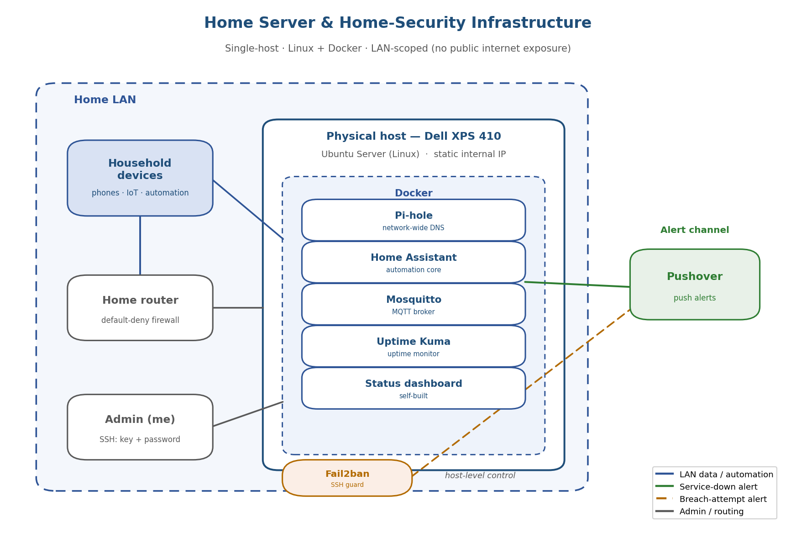

# Overview 
 These documents were created to record the production of a home server. They contain no code and nothing to download. 

# Self-Hosted Home Server

A self-hosted home server that I designed, built, and operate as the central platform for my household's home automation and home-security tooling. It runs entirely on local infrastructure under my own administration, no third-party cloud or subscription service in the control path.

## Architecture at a glance

 (diagram was generated by ai)

The system is a **single physical host** (a repurposed Dell XPS 410) running an **Ubuntu Server**.
Every application runs as a Docker container on that host. The entire platform sits on the local network and is not published to the internet. Administration is over SSH requiring a username and a password. Monitoring and security events are pushed to my phone via Pushover.

Full detail: [`docs/architecture.md`](docs/architecture.md).

---

## Technologies & tools

| Technology | Purpose / role | Deployment |
|---|---|---|
| Ubuntu Server (Linux) | Host operating system for the entire platform | Bare-metal install on the physical host |
| Docker | Container runtime; isolates and runs every service | Installed on the host OS |
| Pi-hole | Network-wide DNS resolution and DNS-level filtering | Docker container |
| Home Assistant | Home automation platform — the core application | Docker container |
| Mosquitto (MQTT) | Message broker connecting automation devices/services | Docker container |
| Uptime Kuma | Self-hosted uptime monitor; detects service outages | Docker container |
| Custom status dashboard | Self-built dashboard for server/system status | Self-built, hosted on the server |
| Fail2ban | Intrusion prevention for SSH (ban after failed logins) | Host-level, protecting SSH |
| Pushover | Push-notification delivery for monitoring/security alerts | Integrated alert channel |
| SSH | Encrypted, LAN-scoped remote administration | Host service;|
| Host firewall (default-deny) | Controls inbound network access to the host | Configured on the host |

Every item above is **currently running in production**. Planned items live in
[`docs/roadmap.md`](docs/roadmap.md), kept separate from live features by design.

---

## Documentation map

| Document | Contents |
|---|---|
| [docs/architecture.md](docs/architecture.md) | System architecture, components, network position, data/alert flows |
| [docs/engineering-decisions.md](docs/engineering-decisions.md) | Key decisions |
| [docs/security.md](docs/security.md) | Security implementation and honest limitations |
| [docs/monitoring.md](docs/monitoring.md) | Monitoring, alerting, reliability, measured availability |
| [docs/roadmap.md](docs/roadmap.md) | Planned and in-progress work; known constraints |

---

## Stack 

- **Linux systems administration** — Ubuntu Server host: OS install, service management, SSH configuration, host firewall.
- **Containerization with Docker** — all platform services deployed and managed as containers on a single host.
- **Network services & DNS** — Pi-hole as network-wide DNS for every device on the LAN, in the critical path of household connectivity.
- **Home automation & IoT messaging** — Home Assistant with a Mosquitto MQTT broker as the messaging backbone.
- **Defensive security / hardening** —  default-deny firewall, Fail2ban, attack-surface reduction by keeping the platform off the public internet, credentials kept off the host.
- **Monitoring & alerting** — Uptime Kuma plus a dashboard, with Pushover alerts for outages and breach attempts.

---

## Current Limitations

- **No backups yet** — no backup of configuration/data exists, and no restore has been tested.
- **No container-level hardening** — containers are not yet run as non-root or with read-only filesystems.
- **Reliability ceiling** — observed uptime ~96%, limited mainly by network instability on aging hardware.

(ai assisted me with setting up docker containers and application setup)